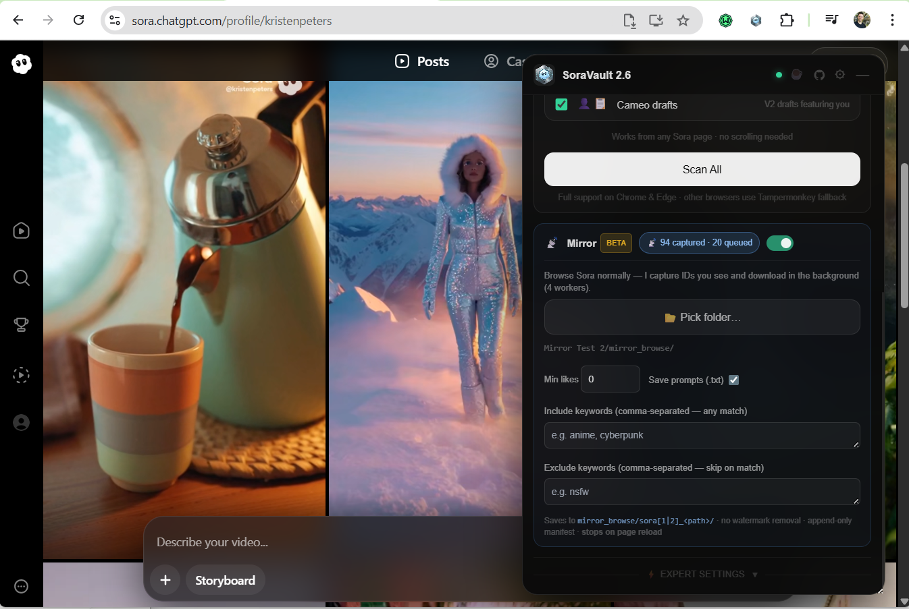

#  SoraVault 2.6 – Bulk Export & Backup Tool for OpenAI Sora

**Your Sora library is about to disappear. Vault it.**
 
Sora is shutting down. OpenAI hasn't released an export tool yet.
SoraVault is a free, API-driven tool to bulk export your OpenAI Sora library. Easily download Sora videos, backup your generated images, save liked content, and extract all original text prompts in minutes, not hours.

> "We'll share more soon, including timelines for the app and API
> and details on preserving your work." - OpenAI, March 24, 2026

**Don't wait for "soon." Your creations deserve better.**

---

## 🆕 New in 2.6 — Mirror mode (beta)

**Just browse Sora normally — SoraVault captures everything you scroll past.**
Mirror mode runs quietly in the background: open Explore, a creator's profile,
your own drafts, or any post, and files land on disk in folders that mirror
where you found them (`mirror_browse/sora2_explore/`, `mirror_browse/sora2_profile/charju/`, …).
No scans, no waiting, no re-downloads. Turn it on, start scrolling, walk away.

[Jump to Mirror mode details →](#-mirror-mode-beta--new-in-26)

---

## ⚡ What makes SoraVault different

| Feature | SoraVault 2.6 | OpenAI Official Export | Manual Download | Other Tools |
|---------|-----------|------------------------|-----------------|-------------|
| FREE | ✅ | ✅ | ✅ | ❌ (only limited) |
| Videos (Sora v2 — Profile) | ✅ | ✅ (mixed with all ChatGPT data) | ❌ (one by one) | ❌ |
| Videos (Sora v2 — Draft) | ✅ | ❌ | ❌ (one by one) | ❌ |
| Images (Sora v1) | ✅ | ✅ (mixed with all ChatGPT data) | ❌ (one by one) | Partial |
| Liked Content (v1 & v2) | ✅ | ❌ | ❌ | ❌ |
| Cameos & Cameo Drafts (Sora v2) | ✅ | ❌ | ❌ | ❌ |
| **Mirror mode — passive capture while browsing** | ✅ **NEW** | ❌ | ❌ | ❌ |
| Original quality (full-res renders) | ✅ | ✅ | ✅ | ❌ (compressed) |
| **Watermark-free downloads** ¹ | ✅ | ❌ | ❌ | ❌ |
| Prompt saved as .txt sidecar | ✅ | ❌ | ❌ | ❌ |
| Raw JSON metadata export | ✅ | ❌ | ❌ | ❌ |
| Bulk download (entire library) | ✅ | ✅ (one ZIP, no filters) | ❌ | Partial |
| Smart filters (source, author, ratio, quality, date, favorites) | ✅ | ❌ | ❌ | ❌ |
| Instant — no waiting period | ✅ | ❌ (days of waiting) | ✅ | ❌ |
| No link expiry | ✅ | ❌ (link expires in 24h) | ✅ | — |
| API-Driven (No page scrolling required) | ✅ | — | — | ❌ |
| Parallel downloads (up to 8x speed) | ✅ | ❌ | ❌ | ❌ |
| Granular auto-folder sorting | ✅ | ❌ | ❌ | ❌ |
| Only Export your Favorites (v1) | ✅ | ❌ | ❌ | ❌ |

¹ Via soravdl.com (third-party proxy — availability not guaranteed). Disabled by default; enable in export settings.

---

## 🎬 See it in action

*1 minute. No fluff. Just the tool doing its thing.*

🎵 *Soundtrack: PULLING by Bastian RENN — [Upcoming on Spotify]*

---

## 🚀 Quick Start

### Option A: Chrome / Edge Extension (for installation in dev mode, more convenient - RECOMMENDED)

[⬇ Download SoraVault — Chrome Extension (latest)](https://github.com/charyou/SoraVault/releases/latest/download/SoraVault-chrome.zip)

1. Download the zip and unpack it to any folder
2. In Chrome/Edge, go to your extension tab, activate developer mode (it's a small toggle switch, usually located in the top right corner).
3. Click the "Load unpacked" button that has now appeared at the top left of the page.
4. Browse to and select the folder where you unzipped the extension files in Step 1.
5. The SoraVault 2 extension should now appear in your list of installed extensions and is ready to use! Never delete that folder while in use.
6. For any future updates, just export the new zip to the same folder, go back to your extension tab, scroll down to SoraVault and press "Reload script"
   

### Option A: Tampermonkey Script 

1. Install [Tampermonkey](https://tampermonkey.net) for your browser. 
> **What is Tampermonkey and is it safe?** > Tampermonkey is a highly trusted browser extension with over 10 million users on the official Chrome and Firefox web stores. It acts as a safe manager that lets you run custom, open-source code on specific websites. It is completely safe—you can read every line of SoraVault's code before installing it, and the script is strictly sandboxed to only run on `sora.chatgpt.com`.
> In your extension tab: Be sure to enable "developer mode", go to details of Tampermonkey and enable "allow user scripts"
2. Download the [latest SoraVault userscript](https://github.com/charyou/SoraVault/releases/latest/download/SoraVault.user.js) — Tampermonkey will auto-detect it and prompt to install. *(If it doesn't, drag & drop the downloaded `.user.js` file into your browser.)*
3. Go to [sora.chatgpt.com](https://sora.chatgpt.com).
4. Use the SoraVault panel on the page: **Scan** → **Filter** (optional) → **Download**.

---

## 🔍 Features in Detail

### 📡 Mirror mode (beta) — new in 2.6

A brand-new way to build your library: instead of running a scan and waiting,
just **browse Sora normally** and SoraVault quietly captures everything you
scroll past and downloads it in the background with 4 parallel workers.

**What it does**
- Watches every Sora API response as you browse — no extra requests, no scanning.
- Saves files as you go, organised by where you found them: `mirror_browse/sora2_explore/`,
  `mirror_browse/sora2_profile/{creator}/`, `mirror_browse/sora1_library/`, and so on.
- Single-post pages (`/p/{id}`) land in the author's folder when SoraVault knows the author.
- Keeps an append-only `mirror_manifest.json` so re-enabling later never re-downloads
  anything already on disk.
- Optional `.txt` prompt sidecar next to each media file (on by default).

**Filters** — capture only what you want:
- **Min likes** — e.g. only save posts with 1,000+ likes.
- **Include keywords** — comma-separated; matches anywhere in the prompt.
- **Exclude keywords** — comma-separated; blocks matches.

**How to use it**
1. Open the SoraVault panel on Sora. You'll see two sections: **Backup** (the
   classic scan + download flow) and **Mirror (beta)**.
2. In the Mirror tile, click **📂 Pick folder…** and choose where captures
   should land. SoraVault creates a `mirror_browse/` subfolder inside it.
3. (Optional) Set a min-likes threshold and/or include/exclude keywords.
4. Flip the Mirror toggle on. The badge shows live status
   (`📡 N captured · M queued` / `📡 N saved`).
5. Browse Sora as you normally would — Explore, creator profiles, your own
   drafts, liked feed, single posts. Files download in the background.
6. Minimise the panel if you like — a small pulsing **📡** stays in the header
   so you know capture is still running.

**Known limitations**
- If the Sora tab fully reloads, Mirror stops (state lives in the page).
  A reload-resume flow is planned for the next release.
- Watermark removal is intentionally skipped in Mirror mode. If you need
  watermark-free MP4s, use the regular Backup flow with watermark removal on.

### Full Library Support
- **Sora v2 Videos** — Profile videos AND Draft videos, full resolution.
- **Sora v1 Images** — Your complete image library from classic Sora.
- **Liked Content** — Backup your favorite videos and images from other creators (v1 and v2).
- **Cameos & Cameo Drafts** — Videos where you appear as a cameo (public) and private cameo draft posts. New in v2.5.
- **Export Formats** — Toggle between saving media, prompt `.txt` sidecars, and raw `.json` payload metadata.

### Intelligent Data Capture
- **API-Driven Architecture** — Operates entirely via API interception and background calls. No more clunky auto-scrolling or relying on page elements.
- **Independent Pipelines** — Manage scanning sources independently (v1 library, v1 liked, v2 profile, v2 drafts, v2 liked, v2 cameos, v2 cameo drafts).
- **Skip Errors** — Automatically detects and skips items flagged as `sora_error` or `sora_content_violation`.
- **Hardcoded Auth (Optional)** — Advanced users can hardcode their `BEARER_TOKEN` in the config to bypass manual interception.

### Granular Filter Engine
- 🗂️ **Category filter** — filter by source (Profile, Liked, Cameos, Drafts…) before downloading. New in v2.5.
- ⭐ **Favorites filter** — export only the items you've starred within your own v1 library, without pulling your entire collection. New in v2.5.
- 🔎 Live full-text search across all prompts
- 🚫 **Author Exclusion** — Easily filter out specific creators when backing up your "Liked" feed. For example, yourself.
- 📐 Aspect ratio chips (16:9, 9:16, 1:1, etc.)
- 🖼️ Quality filter (1080p, original renders)
- 🎨 Operation filter (generate / extend / edit)
- 📅 Date range picker
- 🔢 Index range (e.g., items 10–50 only)

### Archive-Grade Downloads
- **Original source files** from OpenAI servers (not preview thumbnails)
- **Watermark-free downloads** — Profile and Liked videos can be fetched via the soravdl.com third-party proxy, removing the Sora watermark automatically. Adds ~5–6s per video. Disabled by default; enable in export settings. Auto-disables on persistent failure and falls back to direct download. Availability depends on soravdl.com uptime. New in v2.5.
- **Granular Auto-Sorting** — Content is automatically sorted into smart subfolders: `sora_v1_images`, `sora_v1_videos`, `sora_v1_liked`, `sora_v2_profile`, `sora_v2_drafts`, `sora_v2_liked`, `sora_v2_cameos`, `sora_v2_cameo_drafts`.
- **Smart naming** — `{date}_{prompt}_{genId}` with auto-truncation
- **Custom output folder** via File System Access API (one permission, zero popups)

### Performance
- Up to 8 parallel downloads (Standard / Faster / Very fast presets)
- Live activity status line — see what each worker is doing in real time. New in v2.5.
- Built-in rate-limit protection
- Visual progress bar + detailed log
- Safe abort at any time

---

## 🛡️ Privacy & Security

- **100% local** — no data leaves your browser
- **No accounts** — no login, no tracking, no analytics
- **Source available** — read every line of code yourself

---

## 💬 Frequently Asked Questions (FAQ)

**Q: How do I backup my unpublished Sora drafts?**
A: You can backup your Sora drafts using SoraVault. While OpenAI’s official data export currently only includes published profile videos, SoraVault connects directly to your v2 drafts pipeline via API and downloads them in full resolution, along with their text prompts.

**Q: Can't I just use OpenAI's official ChatGPT data export?**
A: Yes, but it has severe limitations for video creators. The official export (Settings → Data Controls → Export) bundles your Sora content with all ChatGPT text conversations, takes days to process, the link expires in 24 hours, it strips out prompt metadata, and **crucially, it does not export your v2 Drafts**. SoraVault solves this by running instantly and sorting your media into dedicated folders.

**Q: How to export Sora videos in their original, uncompressed resolution?**
A: Simply run SoraVault and leave the "Quality" filter on its default setting. The tool automatically fetches the raw, uncompressed `.mp4` files directly from OpenAI's CDN servers, bypassing the compressed preview thumbnails shown on the web interface.

**Q: Is there a way to download my "Liked" videos from other creators?**
A: Yes! SoraVault 2.0 introduced a dedicated "Liked Content" scanner. It will automatically comb through both your v1 Favorites and v2 Liked feeds, allowing you to save videos generated by other creators to your local drive before the platform shuts down.

**Q: Is SoraVault a web scraper or an API downloader?**
A: SoraVault is a fully API-driven downloader. Version 2.0 replaced legacy screen-scraping with direct API interception. This means it doesn't need to manually scroll your page; it communicates directly with OpenAI's backend, making it up to 5x faster and significantly more reliable.

**Q: Is it safe to use? Is this legal?**
A: Yes and yes. You are only downloading your own generated content and data you are already authorized to access while logged into your own account. SoraVault is 100% open-source, runs entirely locally in your browser via Tampermonkey, and sends zero data to third parties.

**Q: Will this tool still work after OpenAI shuts down Sora?**
A: No. SoraVault relies on reading data directly from Sora's live servers. Once the servers are taken offline, this tool will stop working. **You must run your backup before the official shutdown date.**

**Q: I have 500+ files. How long does it take?**
A: Because v2.0 is fully API-driven, it takes only under 2 minutes to scan your library. With default settings (2 parallel downloads), expect ~10 minutes for the download phase. With watermark removal enabled, add ~5–6s per eligible video. Depends on connection speed.

**Q: Why Tampermonkey and not a browser extension?**
A: Tampermonkey is actually easier to install and use than sideloading a CRX extension (which requires Developer Mode and shows browser warnings). One click to install, auto-updates, zero nag screens.

**Q: Why does watermark removal add time to my download?**
A: Watermark-free downloads are fetched through soravdl.com, a third-party proxy not affiliated with SoraVault. It takes 5–6 seconds per video and its availability is not guaranteed. For large libraries, the time estimate badge in the UI shows the extra time before you start. The feature is disabled by default — enable it in export settings, and SoraVault will automatically fall back to direct download if the proxy is unavailable.

**Q: Is this a Sora scraper or Sora downloader?**
A: SoraVault acts as a complete Sora video downloader and library backup tool, capturing everything via API rather than traditional screen scraping.

---

## ☕ Support This Project

If SoraVault saved your library, consider buying me a coffee:

**[☕ buymeacoffee.com/soravault →](https://buymeacoffee.com/soravault)**

This is a passion project born from the "oh shit, my stuff is about to vanish" moment.
Every coffee helps and is deeply appreciated.

---

## 📄 License

SoraVault – Custom License
Copyright (c) 2026 Sebastian Haas (github.com/charyou)

Permission is granted to use this software for personal, non-commercial purposes.
Personal modifications are permitted for private use.

Contributions (pull requests) to the original repository are welcome and encouraged.

The following are NOT permitted without explicit written permission from the author:
- Redistribution of this software or modified versions, in any form
- Commercial use, resale, or monetization of this software or derivatives
- Publishing or distributing modified versions under a different name or identity

Any public reference to this software must include clear attribution to the original
author (Sebastian Haas) and a link to https://github.com/charyou/SoraVault.

This software is provided as-is, without warranty of any kind.

*Credits*
- Watermark removal logic inspired by Casey Jardin (MIT License).

---

*Built with urgency and care by Sebastian* —
 [X](https://x.com/charjou) — [LinkedIn](https://www.linkedin.com/in/-sebastian-haas/)