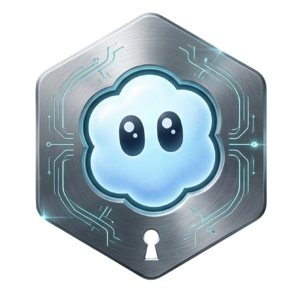

# <sub></sub> SoraVault 2.7 - Bulk Export & Backup Tool for OpenAI Sora

**Your Sora library is about to disappear. Vault it.**

SoraVault is a free, local-first, API-driven tool to bulk export your OpenAI
Sora library. It backs up Sora 1 images, Sora 2 videos, drafts, liked content,
cameos, character content, creator libraries, prompts, and metadata without
waiting for a platform export.

> "We'll share more soon, including timelines for the app and API
> and details on preserving your work." - OpenAI, March 24, 2026

**Don't wait for "soon." Your creations deserve better.**

---

## New in 2.7


SoraVault 2.7 redesigns the first screen around exclusive backup modes:

- **Regular Backup** - the main path for backing up your own Sora 1 and Sora 2
  content.
- **Creator Backup** - back up public Sora 2 creators by username, including
  their characters when enabled.
- **Mirror Mode** - browse Sora normally and capture matching content in the
  background.
- **Likes range filter** - filter Regular Backup and Creator Backup results by
  minimum and maximum like count before downloading.
- **Cleaner startup UX** - modes cannot be combined accidentally. Creator Backup
  no longer requires a regular source checkbox just to unlock Start Scan.

---

## See It In Action

[](https://youtu.be/yEtdvpIedq4)

*1 minute. No fluff. Just the tool doing the work.*

---

## Quick Start

### Option A: Chrome / Edge Extension (recommended)

[Download SoraVault - Chrome Extension (latest)](https://github.com/charyou/SoraVault/releases/latest/download/SoraVault-chrome.zip)

1. Download the zip and unpack it to any folder.
2. In Chrome/Edge, open the extensions page and enable Developer mode.
3. Click **Load unpacked**.
4. Select the folder where you unpacked the extension.
5. Open [sora.chatgpt.com](https://sora.chatgpt.com).
6. Use the SoraVault panel: choose a mode, scan or start Mirror, filter, then
   download.

### Option B: Tampermonkey Script

1. Install [Tampermonkey](https://tampermonkey.net).
2. Download the [latest SoraVault userscript](https://github.com/charyou/SoraVault/releases/latest/download/SoraVault.user.js).
   Tampermonkey should detect it and prompt you to install.
3. Open [sora.chatgpt.com](https://sora.chatgpt.com).
4. Use the SoraVault panel on the page.

Tampermonkey is a widely used user-script manager. SoraVault runs only on
`sora.chatgpt.com`, is open source, and keeps all work local in your browser.

---

## Feature Priorities

| Priority | Feature | What SoraVault does |
|----------|---------|---------------------|
| 1 | **Regular Backup** | Backs up your own Sora 1 library, Sora 1 likes, Sora 2 profile videos, drafts, liked videos, cameos, cameo drafts, and your own character content. |
| 2 | **Highest-quality files + prompts** | Downloads original media where available, often higher quality than what manual UI downloads expose, and can save `.txt` prompt sidecars plus raw `.json` metadata. |
| 3 | **Watermark removal** | Optional watermark-free Sora 2 downloads for supported video sources through `soravdl.com`. This is a third-party proxy and availability is not guaranteed. |
| 4 | **Filters before download** | Filter by source, prompt text, author exclusion, aspect ratio, quality, operation, date, first/last N, favorites, and likes range. |
| 5 | **Creator Backup** | Fetch public Sora 2 creators by username, optionally including their characters and appearances. |
| 6 | **Mirror Mode** | Capture what you browse in the background with like and keyword filters, saved into a `mirror_browse/` folder. |
| 7 | **Resume-friendly downloads** | Skip existing files by ID and minimum size checks, so re-runs fill only what is missing. |
| 8 | **Local-first workflow** | No SoraVault account, no cloud service, no analytics, no server-side storage. |

---

## Feature Details

### Regular Backup

Regular Backup is the primary SoraVault workflow. It scans selected Sora sources,
builds a local result list, lets you filter that list, then downloads exactly
what you choose.

Supported regular backup sources:

- **Sora 1 Library** - your generated image library.
- **Sora 1 Likes** - liked Sora 1 content, which the official export does not
  give you as a clean Sora-only collection.
- **Sora 2 Videos** - your published profile posts.
- **Sora 2 Drafts** - unpublished generated drafts. These are the files most
  people cannot get from OpenAI's general account export.
- **Sora 2 Liked** - liked Sora 2 videos from other creators, without clicking
  through one item at a time.
- **Sora 2 Cameos** - public posts featuring you.
- **Sora 2 Cameo Drafts** - private draft posts featuring you.
- **Characters** - your own character posts and appearances.

Regular Backup is API-driven. It does not depend on scrolling the page to find
your own library.

### Archive-Grade Downloads

- Saves full media files from OpenAI/Sora URLs instead of browser thumbnails or
  compressed previews.
- Prioritizes highest-quality source URLs where the API exposes them. This also
  applies to creator content, where manual downloads often surface lower-quality
  or less convenient files.
- Optional `.txt` sidecar with prompt and useful metadata.
- Optional raw `.json` manifest for audit/archive use.
- Smart default filenames: `{genId}_{date}_{prompt}`.
- Auto-sorted folders such as `sora_v2_profile`, `sora_v2_drafts`,
  `sora_v2_liked`, `sora_v2_creators/{name}/`, and `mirror_browse/...`.
- Skip-existing support for safe re-runs.
- Pause, resume, stop, progress, ETA, and live worker activity.

### Watermark Removal

Watermark removal is optional and disabled by default. When enabled, supported
Sora 2 video downloads can be fetched through `soravdl.com` to remove the Sora
watermark.

Important disclaimer:

- `soravdl.com` is a third-party proxy and is not affiliated with SoraVault.
- Availability, rate limits, and response quality are not guaranteed.
- SoraVault automatically falls back to direct OpenAI/Sora downloads if the
  proxy fails repeatedly or times out.
- Watermark removal is intentionally not used by Mirror Mode.

### Filters

SoraVault lets you narrow scanned results before download:

- Source/category.
- Prompt keyword search.
- Author exclusion for liked content.
- Aspect ratio.
- Quality.
- Operation.
- Date range.
- First or last N items.
- Favorites-only for Sora 1 library.
- Minimum and maximum likes.

When a likes range is active, items without a known like count are excluded so
the final selection matches the range intentionally.

### Creator Backup

Creator Backup is for public Sora 2 creators.

Add one or more creator usernames, or paste profile URLs. Each creator chip is
validated live against the Sora API. Valid creators can be remembered across
reloads by default.

Creator Backup can download:

- The creator's public posts.
- Their characters' posts.
- Their characters' cameo appearances.

Files are stored under:

```text
sora_v2_creators/{creator}/
sora_v2_creators/{creator}/characters/{character}/
```

Creator Backup requires Sora 2 access. If Sora 2 is geo-blocked, use Regular
Backup for Sora 1 sources or Mirror Mode for whatever content you can browse.

### Mirror Mode

Mirror Mode is a passive capture mode. Instead of scanning a fixed endpoint,
turn it on and browse Sora normally. SoraVault watches Sora API responses,
captures downloadable items that pass your filters, and saves them in the
background.

Mirror Mode supports:

- Sora 1 and Sora 2 browsing flows.
- Explore pages.
- Creator profiles.
- Drafts and liked feeds when visible to you.
- Single-post pages.
- Minimum likes.
- Include keywords.
- Exclude keywords.
- Optional prompt `.txt` sidecars.
- Append-only `mirror_manifest.json` to avoid re-downloading saved items.

Files are saved into folders that mirror where content was found, for example:

```text
mirror_browse/sora2_explore/
mirror_browse/sora2_profile/{creator}/
mirror_browse/sora1_library/
```

Known limitation: Mirror Mode state lives in the current Sora page. If the tab
fully reloads, start Mirror Mode again.

---

## How SoraVault Compares

OpenAI's official export is useful as a general account archive, but it is not a
focused Sora backup workflow. It mixes Sora files into a full ChatGPT export,
does not expose several Sora-only collections, and gives you no pre-download
filters. Manual download is fine for one favorite video, but it breaks down as
soon as you need drafts, liked content, creator libraries, prompts, metadata, or
hundreds of files.

| Capability | SoraVault 2.7 | OpenAI Export | Manual Download |
|------------|---------------|---------------|-----------------|
| Sora 1 generated library | Yes, Sora-only folders | Mixed into full account export | One by one |
| Sora 1 liked content | Yes | No clean Sora-only liked archive | One by one |
| Sora 2 published profile videos | Yes | Mixed into full account export | One by one |
| Sora 2 drafts | Yes | No | One by one, if exposed in UI |
| Sora 2 liked videos | Yes | No | One by one |
| Cameos and cameo drafts | Yes | No | Not practical |
| Your character content | Yes | No | Not practical |
| Public creator backup by username | Yes | No | One by one |
| Creator character backup | Yes | No | Not practical |
| Mirror/passive browsing capture | Yes | No | No |
| Highest-quality source selection | Yes | Mixed/opaque | Often UI-limited |
| Prompt `.txt` sidecars | Yes | No | No |
| Raw JSON metadata manifest | Yes | Limited | No |
| Filters before download | Yes | No | No |
| Min/max likes filter | Yes | No | No |
| Watermark removal | Optional, third-party | No | No |
| Resume / skip existing files | Yes | No | No |
| Local-first workflow | Yes | Account export request | Yes |

---

## Privacy & Security

- **100% local** - no SoraVault server receives your files or prompts.
- **No SoraVault account** - nothing to sign into besides Sora itself.
- **No tracking** - no analytics or telemetry.
- **Open source** - inspect the code before running it.
- **You choose the folder** - Chrome/Edge can save directly into your selected
  folder through the File System Access API.

---

## FAQ

**Q: How do I backup my unpublished Sora drafts?**  
A: Use Regular Backup and keep the Sora 2 Drafts source selected. SoraVault
connects directly to the drafts endpoint and downloads the full-resolution video
where available, with prompts if sidecars are enabled. This is one of the key
things OpenAI's general account export does not currently solve as a clean Sora
backup.

**Q: Can't I just use OpenAI's official ChatGPT data export?**  
A: You can, but it is not a focused Sora backup tool. The official export bundles
Sora content into a much larger ChatGPT account archive, can take time to arrive,
does not give you Sora-specific filters, does not cleanly cover liked content,
and does not provide the same direct workflow for drafts, creator backup,
sidecar prompts, or folder sorting.

**Q: How to export Sora videos in their original, uncompressed resolution?**  
A: Run SoraVault, scan your sources, and keep quality filters broad unless you
want to narrow the result set. SoraVault prioritizes source/original media URLs
where the API exposes them, avoiding preview thumbnails and compressed browser
surfaces where possible.

**Q: Is there a way to download my "Liked" videos from other creators?**  
A: Yes. Regular Backup supports Sora 1 liked content and Sora 2 liked videos.
That means you can back up creator content you liked without opening and saving
each item manually.

**Q: Can I bulk download Sora creator content by username?**  
A: Yes. Use Creator Backup, add one or more Sora creator usernames or profile
URLs, wait for validation, then start the scan. SoraVault can also include those
creators' characters and appearances.

**Q: Should I use Creator Backup or Mirror Mode for a creator?**  
A: Use Creator Backup when you want the creator's public library by username.
Use Mirror Mode when you want to browse manually and capture only what passes
your live like/keyword filters.

**Q: Why does watermark removal add time to my download?**  
A: Watermark-free files are fetched through `soravdl.com`, a third-party proxy.
It can add several seconds per video and may be rate-limited or unavailable.
SoraVault falls back to direct downloads when the proxy fails. The feature is
disabled by default and should be treated as optional.

**Q: Is SoraVault a web scraper or an API downloader?**  
A: SoraVault is primarily an API-driven downloader. Regular Backup talks to Sora
endpoints directly while you are logged in. Mirror Mode passively watches Sora
API responses as you browse. It does not need to scroll the page to build your
regular backup.

**Q: Is this a Sora scraper or Sora downloader?**  
A: SoraVault acts as a Sora video downloader, Sora image downloader, and Sora
library backup tool. The normal backup flow is API-driven; Mirror Mode is a
passive capture mode for content you browse.

**Q: Is it safe to use? Is this legal?**  
A: SoraVault is intended for backing up content and data you can access while
logged into Sora. It runs locally in your browser and does not upload your
content elsewhere.

**Q: I have 500+ files. How long does it take?**  
A: Scanning is usually much faster than downloading because SoraVault talks to
the API directly. Download time depends on connection speed, selected output
formats, worker speed, watermark removal, and whether skip-existing can avoid
files already on disk.

**Q: Why Tampermonkey and not a browser extension?**  
A: SoraVault supports both. The Chrome/Edge extension is the recommended install
path for many users, while Tampermonkey remains useful for people who prefer a
userscript workflow or want quick script updates.

**Q: Will SoraVault work after Sora shuts down?**  
A: No. It depends on Sora's live APIs and media URLs. Run your backup before the
service is unavailable.

---

## Support This Project

If SoraVault saved your library, consider buying me a coffee:

**[buymeacoffee.com/soravault](https://buymeacoffee.com/soravault)**

This is a passion project born from the "oh shit, my stuff is about to vanish"
moment. Every coffee helps and is deeply appreciated.

---

*Built with urgency and care by Sebastian* - [X](https://x.com/charjou) -
[LinkedIn](https://www.linkedin.com/in/-sebastian-haas/)
